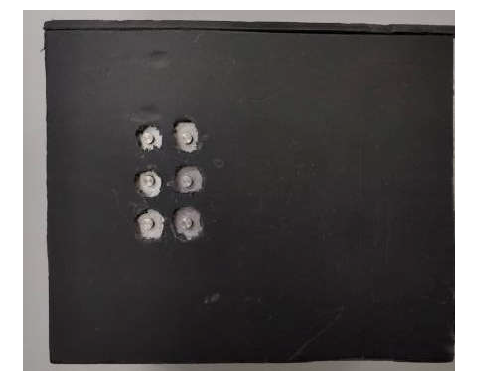

# A Dual-Purpose Refreshable Braille Display Based on Real Time Object Detection and Optical Character Recognition
Official repository for Dual Purpose Refreshable Braille, SPICSCON 2019

## [Paper][paper]
[paper]: http://naimulhassan.github.io/content/papers/braille.pdf

          
          
</td>

Abstract: <i>This paper proposes a dual-purpose braille system for the visually impaired people. There are two main features of this system- object detection and optical character recognition. Real time object detection will help a visually impaired person to know about the things around him and optical character recognition will help him reading characters in both international (English) and local community (Bengali) language. In this paper, the detailed methodology of our proposed method is described. A pre-trained convolutional neural network (AlexNet) is used for classifying the objects and an OCR engine (Tesseract) along with basic image processing is used for optical character recognition. A refreshable braille display is also designed to show the braille characters.</i>

## Citation
@INPROCEEDINGS{9065110, 
  author={Naimul Hassan, K M and Biswas, Subrata Kumar and Anwar, Md Shakil and Iman Siam, Md Shakhrul and Shahnaz, Celia}, 
  booktitle={2019 IEEE International Conference on Signal Processing, Information, Communication & Systems (SPICSCON)},  
  title={A Dual-Purpose Refreshable Braille Display Based on Real Time Object Detection and Optical Character Recognition},  
  year={2019}, 
  volume={}, 
  number={}, 
  pages={78-81}, 
  doi={10.1109/SPICSCON48833.2019.9065110}}